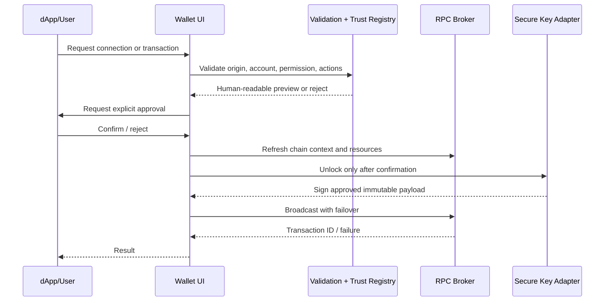

# WAX Vault v1.0 security-reviewed specification (implementation baseline)

## Risk assessment

| Risk | Impact | Controls | Release requirement |
|---|---|---|---|
| Seed/private-key compromise | Critical | audited derivation, OS keystore, encrypted browser vault, auto-lock, no telemetry | independent audit and recovery tests |
| Malicious dApp/phishing | Critical | HTTPS/origin validation, allowlist, normalized origin display, explicit action approval | phishing test suite |
| Untrusted token/contract | Critical | immutable reviewed contract registry, action/symbol matching, remote metadata display-only | registry review/sign-off |
| Slippage/price manipulation | High | quoted expiry, minimum output, bounded slippage, trusted route, atomic fee action | DEX integration audit |
| RPC/indexer outage | Medium | endpoint failover, stale-data labels, retry/backoff | outage drills |
| NFT price deception | Medium | AtomicHub source label, timestamp, lowest-listing wording, no guaranteed valuation | UI review |
| Privacy leakage | High | no analytics by default, secret redaction, CSP, local-only sensitive state | privacy review |

## Phishing protections

- Display normalized HTTPS origin, account, permission, contract, action, recipient, quantity, fee, slippage, expiry, and network in every approval.
- Never sign requests originating from an unverified origin or with an account/permission mismatch.
- Use a reviewed contract registry; token names, logos, and remote metadata are not trust signals.
- Warn on lookalike domains, punycode, new origins, changed contracts, unlimited approvals, and unknown actions.
- Require re-approval after session expiry, account change, chain change, or material action mutation.

## Signing flow

## NFT pricing

NFT prices are presented as the lowest active AtomicMarket listing returned by the AtomicHub/AtomicAssets API, with source and timestamp. This is not an appraisal, floor guarantee, or USD valuation. Missing/stale pricing must be displayed as unavailable.

## App Store submission checklist

- [ ] Privacy policy, support URL, data-safety declarations, export compliance, legal entity.
- [ ] Signed release builds, pinned dependencies, SBOM, reproducible build evidence.
- [ ] Keychain/Keystore device-only storage, biometric unlock, auto-lock, backup/restore tests.
- [ ] Testnet/mainnet separation, network indicator, deep-link and QR validation.
- [ ] Accessibility, localization, screenshots, app icons, consent and error-state testing.
- [ ] Security audit remediation, incident response, crash reporting with secret redaction.

## Release gate criteria

Block release if any gate fails: audited key derivation; no secret leakage; all signing paths enforce explicit approval and contract registry checks; dApp origin controls pass; slippage/deadline and fee actions are atomic and audited; RPC failover/outage tests pass; backup recovery succeeds; critical/high vulnerabilities are fixed; store compliance and privacy review are complete.

This document describes a target release baseline, not a claim that the current prototype is security-reviewed or production-ready.
